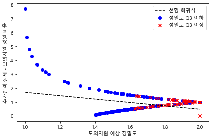
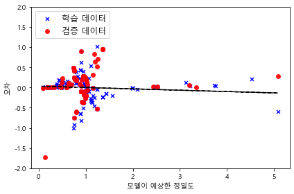
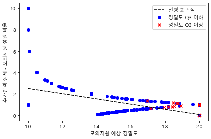
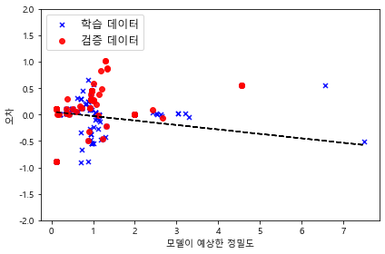
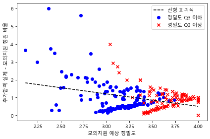
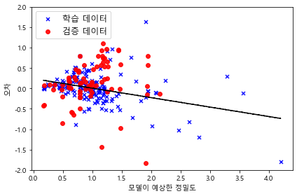
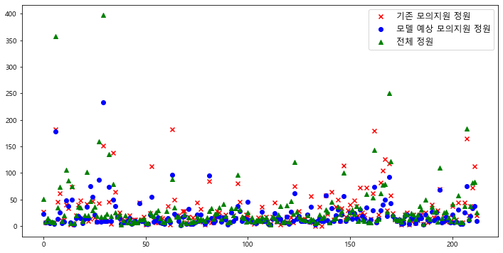

```python
%matplotlib inline

import pandas as pd
import numpy as np
import seaborn as sns
import matplotlib.pyplot as plt
import matplotlib as mpl
import warnings

warnings.filterwarnings("ignore", category=Warning)
```

    C:\ProgramData\Anaconda3\lib\site-packages\statsmodels\tools\_testing.py:19: FutureWarning: pandas.util.testing is deprecated. Use the functions in the public API at pandas.testing instead.
      import pandas.util.testing as tm
    


```python
# matplotlib 한글 설정

%matplotlib inline
import matplotlib.pyplot as plt
import sys

from matplotlib import font_manager, rc

if sys.platform == 'darwin' :
    path = '/Library/Fonts/AppleGothic.ttf'
elif sys.platform == 'win32' :
    path = "c:/Windows/Fonts/malgun.ttf"
else:
    print('Unknown system... sorry~~~')
    
font_name = font_manager.FontProperties(fname = path).get_name()
rc('font', family = font_name)
plt.rcParams['axes.unicode_minus'] = False
```


```python
from sklearn.model_selection import train_test_split
from sklearn.linear_model import RANSACRegressor
from sklearn.preprocessing import PolynomialFeatures
from sklearn.linear_model import LinearRegression
from sklearn.preprocessing import PolynomialFeatures
from sklearn.ensemble import RandomForestRegressor
```


```python
# 커트라인 정보 업로드

cutline = pd.read_csv('cutline181920.csv', sep = ',')
cutline = cutline.dropna(axis = 0)
ys_2018 = pd.read_csv('ys_2018_score.csv', sep = ',')
ys_2019 = pd.read_csv('ys_2019_score.csv', sep = ',')
ys_2020 = pd.read_csv('ys_2020_score.csv', sep = ',')
ssk_2018 = pd.read_csv('ssk_2018_score.csv', sep = ',')
ssk_2019 = pd.read_csv('ssk_2019_score.csv', sep = ',')
ssk_2020 = pd.read_csv('ssk_2020_score.csv', sep = ',')
kr_2018 = pd.read_csv('kr_2018_score.csv', sep = ',')
kr_2019 = pd.read_csv('kr_2019_score.csv', sep = ',')
kr_2020 = pd.read_csv('kr_2020_score.csv', sep = ',')
```


```python
def sigmoid(x):
        return 1 / (1 +np.exp(-x))
```


```python
def lin_regplot(X, y, model):
    plt.plot(X, model.predict(X), color='black', lw=1.5, linestyle = '--')    
    return 
```


```python
class trash_moejiwon(object):
    def __init__(self, df = ys_2018, score = 100):
        self.df = df
        self.score = score
        
    # 전처리 단계 (최종 정원 구하고, 인문-자연 계열 구분하기)
    def _1(self):
        self.df['최종 정원'] = self.df['이월 전 정원'] + self.df['수시 이월 정원']
        self.df = pd.merge(self.df, cutline[['major_name', 'calc_type']], how = 'left')
        self.df = self.df.drop_duplicates()
        return self
    
    # 전처리 단계2 (모의지원 실지원 최초합격자, 추가합격자 구분,
    # 실제 정원과 모의지원 합격자의 차이를 정원과 나눈 후 시그모이드 함수로 처리한 정밀도,
    # 실제 정원 대비 모의고사 정원 비율 구함)
    def _2(self):
        self.df.s1 = []; self.df.s2 = []; self.df.s3 = []; 
        self.df.s4 = []; self.df.s5 = []; self.df.s6 = [];
        self.df.s = pd.DataFrame([self.df.groupby(['major_name','지원 결과',
                                              'real_apply']).year.count()])
        self.df.t = self.df[['major_name', 'univ_name',
                             'calc_type', '최종 정원', '추가 합격자 수',
                             '최초합격 커트라인', '최종 커트라인', 'year']].drop_duplicates()
        self.df.t = self.df.t.reset_index(drop=True)
        self.df.t = self.df.t.drop_duplicates(['major_name'])
        for i in np.unique(self.df.major_name):
            try:
                self.df.s1.append(self.df.s[i]['최초합격'][True][0])
            except KeyError:
                self.df.s1.append(0)
            try:
                self.df.s3.append(1/sigmoid(abs(float(self.df.t[self.df.t['major_name'] == i]['최종 정원'].values[0]) - self.df.s[i]['최초합격'][True][0])/float(self.df[self.df['major_name'] == i]['최종 정원'].values[0])))
            except KeyError:
                self.df.s3.append(0)
            try:
                self.df.s5.append(float(self.df.s[i]['최초합격'][True][0])/float(self.df.t[self.df.t['major_name'] == i]['최종 정원'].values[0]))
            except KeyError:
                self.df.s5.append(0)
            try:
                self.df.s2.append(self.df.s[i]['추가합격'][True][0])
                self.df.s4.append(1/sigmoid(abs(float(self.df.t[self.df.t['major_name'] == i]['추가 합격자 수'].values[0]) - self.df.s[i]['추가합격'][True][0])/float(self.df[self.df['major_name'] == i]['추가 합격자 수'].values[0])))
                self.df.s6.append(float(self.df.s[i]['추가합격'][True][0])/float(self.df.t[self.df.t['major_name'] == i]['추가 합격자 수'].values[0]))
            except ZeroDivisionError:
                self.df.s6.append(1)
            except AttributeError:
                self.df.s2.append(0)
                self.df.s4.append(0)
                self.df.s6.append(0)
            except KeyError:
                self.df.s2.append(0)
                self.df.s4.append(0)
                self.df.s6.append(0)
            
        self.df.t['True 최초합격자'] = self.df.s1
        self.df.t['True 추가합격자'] = self.df.s2
        self.df.t['모의지원 예상 정밀도 (최초합격)'] = self.df.s3
        self.df.t['모의지원 예상 정밀도 (추가합격)'] = self.df.s4
        self.df.t['최초합격 실제 - 모의지원 정원 비율'] = self.df.s5
        self.df.t['추가합격 실제 - 모의지원 정원 비율'] = self.df.s6
        self.df = self.df.t
        return self
    
    # 문과 점수 환산. 대학별 반영비에다가 1컷 커트라인 기준.
    def _m(self):
        self.df.m = self.df[self.df.calc_type == '인문']
        self.df.m['최초합격 커트라인'] = self.df.m['최초합격 커트라인']/self.score
        self.df.m['최종 커트라인'] = self.df.m['최종 커트라인']/self.score
        return self.df.m
    
    # 이과 점수 환산. 대학별 반영비에다가 1컷 커트라인 기준.
    def _g(self):
        self.df.g = self.df[self.df.calc_type == '자연']
        self.df.g['최초합격 커트라인'] = self.df.g['최초합격 커트라인']/self.score
        self.df.g['최종 커트라인'] = self.df.g['최종 커트라인']/self.score
        return self.df.g
```


```python
# 문이과 환산 점수표 합치기

def preprocessing(df, score_m, score_g):
    df.m = trash_moejiwon(df = df, score = score_m)._1()._2()._m()
    df.g = trash_moejiwon(df = df, score = score_g)._1()._2()._g()
    df = pd.concat([df.m, df.g])
    df['최초 - 최종 커트라인'] = df['최초합격 커트라인'] - df['최종 커트라인']
    df = df.reset_index(drop=True)
    return df
```


```python
# 성균관대학교
# 2018년 인문 = 753.4, 자연 = 744.865
# 2019년 인문 = 763, 자연 = 756.985
# 2020년 인문 = 771.68 자연 = 755.425

# 연세대학교
# 2019년 인문 = 720.65, 자연 = 696.84
# 2020년 인문 = 728.13 자연 = 698.2

# 고려대학교
# 2018년 인문 = 653.1, 자연 = 643.96
# 2019년 인문 = 661.68, 자연 = 656.84
# 2020년 인문 = 669.48 자연 = 658.21

# 연대 2018년 데이터는 추합 인원쪽에 오류가 나서 보류함

ssk_2018 = preprocessing(ssk_2018, 753.4, 744.865)
ssk_2019 = preprocessing(ssk_2019, 763, 756.985)
ssk_2020 = preprocessing(ssk_2020, 771.68, 755.425)
kr_2018 = preprocessing(kr_2018, 653.1, 643.96)
kr_2019 = preprocessing(kr_2019, 661.68, 656.84)
kr_2020 = preprocessing(kr_2020, 669.48, 658.21)
ys_2019 = preprocessing(ys_2019, 720.65, 696.84)
ys_2020 = preprocessing(ys_2020, 728.13, 698.2)
```


```python
# 점수 표를 전부 합치고, 추가합격 인원이 0일때 발생하는 오차 처리

shit_moejiwon = pd.concat([ssk_2018, ssk_2019, ssk_2020,
                          kr_2018, kr_2019, kr_2020,
                          ys_2019, ys_2020])
shit_moejiwon['모의지원 예상 정밀도 (최초합격)'] = shit_moejiwon['모의지원 예상 정밀도 (최초합격)'].apply(lambda x: 2.0000 if x == 0 else x)
shit_moejiwon['모의지원 예상 정밀도 (추가합격)'] = shit_moejiwon['모의지원 예상 정밀도 (추가합격)'].apply(lambda x: 2.0000 if x == 0 else x)
shit_moejiwon['모의지원 예상 정밀도'] = shit_moejiwon['모의지원 예상 정밀도 (최초합격)'] + shit_moejiwon['모의지원 예상 정밀도 (추가합격)']
shit_moejiwon['전체 실제 - 모의지원 정원 비율'] =  (shit_moejiwon['True 최초합격자'] + shit_moejiwon['True 추가합격자']) / (shit_moejiwon['최종 정원'] + shit_moejiwon['추가 합격자 수'])
```


```python
shit_moejiwon['accuracy'] = shit_moejiwon['모의지원 예상 정밀도']
shit_moejiwon['accuracy'] = shit_moejiwon['accuracy'].apply(lambda x:1 if x >= shit_moejiwon['accuracy'].quantile(.75) else 0)
shit_moejiwon['accuracy1'] = shit_moejiwon['모의지원 예상 정밀도 (최초합격)']
shit_moejiwon['accuracy1'] = shit_moejiwon['accuracy1'].apply(lambda x: 1 if x >= shit_moejiwon['accuracy1'].quantile(.85) else 0)
shit_moejiwon['accuracy2'] = shit_moejiwon['모의지원 예상 정밀도 (추가합격)']
shit_moejiwon['accuracy2'] = shit_moejiwon['accuracy2'].apply(lambda x: 1 if x >= shit_moejiwon['accuracy2'].quantile(.85) else 0)
shit_moejiwon['accuracy3'] = (shit_moejiwon['accuracy1'] | shit_moejiwon['accuracy2'])
shit_moejiwon
```


<div>
<style scoped>
    .dataframe tbody tr th:only-of-type {
        vertical-align: middle;
    }

    .dataframe tbody tr th {
        vertical-align: top;
    }

    .dataframe thead th {
        text-align: right;
    }
</style>
<table border="1" class="dataframe">
  <thead>
    <tr style="text-align: right;">
      <th></th>
      <th>major_name</th>
      <th>univ_name</th>
      <th>calc_type</th>
      <th>최종 정원</th>
      <th>추가 합격자 수</th>
      <th>최초합격 커트라인</th>
      <th>최종 커트라인</th>
      <th>year</th>
      <th>True 최초합격자</th>
      <th>True 추가합격자</th>
      <th>...</th>
      <th>모의지원 예상 정밀도 (추가합격)</th>
      <th>최초합격 실제 - 모의지원 정원 비율</th>
      <th>추가합격 실제 - 모의지원 정원 비율</th>
      <th>최초 - 최종 커트라인</th>
      <th>모의지원 예상 정밀도</th>
      <th>전체 실제 - 모의지원 정원 비율</th>
      <th>accuracy</th>
      <th>accuracy1</th>
      <th>accuracy2</th>
      <th>accuracy3</th>
    </tr>
  </thead>
  <tbody>
    <tr>
      <th>0</th>
      <td>경영학</td>
      <td>성균관대학교</td>
      <td>인문</td>
      <td>49.0</td>
      <td>2.0</td>
      <td>1.002867</td>
      <td>1.002230</td>
      <td>2018</td>
      <td>23</td>
      <td>4</td>
      <td>...</td>
      <td>1.367879</td>
      <td>0.469388</td>
      <td>2.000000</td>
      <td>0.000637</td>
      <td>2.956124</td>
      <td>0.529412</td>
      <td>0</td>
      <td>0</td>
      <td>0</td>
      <td>0</td>
    </tr>
    <tr>
      <th>1</th>
      <td>교육학</td>
      <td>성균관대학교</td>
      <td>인문</td>
      <td>6.0</td>
      <td>2.0</td>
      <td>1.000358</td>
      <td>0.995129</td>
      <td>2018</td>
      <td>4</td>
      <td>3</td>
      <td>...</td>
      <td>1.606531</td>
      <td>0.666667</td>
      <td>1.500000</td>
      <td>0.005230</td>
      <td>3.323062</td>
      <td>0.875000</td>
      <td>0</td>
      <td>0</td>
      <td>0</td>
      <td>0</td>
    </tr>
    <tr>
      <th>2</th>
      <td>글로벌경영학</td>
      <td>성균관대학교</td>
      <td>인문</td>
      <td>36.0</td>
      <td>108.0</td>
      <td>1.012477</td>
      <td>1.003743</td>
      <td>2018</td>
      <td>24</td>
      <td>67</td>
      <td>...</td>
      <td>1.684115</td>
      <td>0.666667</td>
      <td>0.620370</td>
      <td>0.008734</td>
      <td>3.400646</td>
      <td>0.631944</td>
      <td>0</td>
      <td>0</td>
      <td>0</td>
      <td>0</td>
    </tr>
    <tr>
      <th>3</th>
      <td>글로벌경제학</td>
      <td>성균관대학교</td>
      <td>인문</td>
      <td>16.0</td>
      <td>43.0</td>
      <td>1.012968</td>
      <td>1.005283</td>
      <td>2018</td>
      <td>11</td>
      <td>32</td>
      <td>...</td>
      <td>1.774286</td>
      <td>0.687500</td>
      <td>0.744186</td>
      <td>0.007685</td>
      <td>3.505902</td>
      <td>0.728814</td>
      <td>0</td>
      <td>0</td>
      <td>0</td>
      <td>0</td>
    </tr>
    <tr>
      <th>4</th>
      <td>글로벌리더학</td>
      <td>성균관대학교</td>
      <td>인문</td>
      <td>15.0</td>
      <td>0.0</td>
      <td>1.004699</td>
      <td>1.004699</td>
      <td>2018</td>
      <td>7</td>
      <td>0</td>
      <td>...</td>
      <td>2.000000</td>
      <td>0.466667</td>
      <td>0.000000</td>
      <td>0.000000</td>
      <td>3.586646</td>
      <td>0.466667</td>
      <td>0</td>
      <td>0</td>
      <td>1</td>
      <td>1</td>
    </tr>
    <tr>
      <th>...</th>
      <td>...</td>
      <td>...</td>
      <td>...</td>
      <td>...</td>
      <td>...</td>
      <td>...</td>
      <td>...</td>
      <td>...</td>
      <td>...</td>
      <td>...</td>
      <td>...</td>
      <td>...</td>
      <td>...</td>
      <td>...</td>
      <td>...</td>
      <td>...</td>
      <td>...</td>
      <td>...</td>
      <td>...</td>
      <td>...</td>
      <td>...</td>
    </tr>
    <tr>
      <th>47</th>
      <td>천문우주학과</td>
      <td>연세대학교</td>
      <td>자연</td>
      <td>10.0</td>
      <td>7.0</td>
      <td>0.991206</td>
      <td>0.988771</td>
      <td>2020</td>
      <td>2</td>
      <td>0</td>
      <td>...</td>
      <td>2.000000</td>
      <td>0.200000</td>
      <td>0.000000</td>
      <td>0.002435</td>
      <td>3.449329</td>
      <td>0.117647</td>
      <td>0</td>
      <td>0</td>
      <td>1</td>
      <td>1</td>
    </tr>
    <tr>
      <th>48</th>
      <td>치의예과</td>
      <td>연세대학교</td>
      <td>자연</td>
      <td>20.0</td>
      <td>18.0</td>
      <td>1.017259</td>
      <td>1.015726</td>
      <td>2020</td>
      <td>16</td>
      <td>22</td>
      <td>...</td>
      <td>1.800737</td>
      <td>0.800000</td>
      <td>1.222222</td>
      <td>0.001533</td>
      <td>3.619468</td>
      <td>1.000000</td>
      <td>0</td>
      <td>0</td>
      <td>0</td>
      <td>0</td>
    </tr>
    <tr>
      <th>49</th>
      <td>컴퓨터과학과</td>
      <td>연세대학교</td>
      <td>자연</td>
      <td>37.0</td>
      <td>44.0</td>
      <td>1.003824</td>
      <td>0.996734</td>
      <td>2020</td>
      <td>38</td>
      <td>34</td>
      <td>...</td>
      <td>1.796703</td>
      <td>1.027027</td>
      <td>0.772727</td>
      <td>0.007090</td>
      <td>3.770038</td>
      <td>0.888889</td>
      <td>1</td>
      <td>1</td>
      <td>0</td>
      <td>1</td>
    </tr>
    <tr>
      <th>50</th>
      <td>화공생명공학부</td>
      <td>연세대학교</td>
      <td>자연</td>
      <td>38.0</td>
      <td>45.0</td>
      <td>1.001977</td>
      <td>0.992237</td>
      <td>2020</td>
      <td>56</td>
      <td>56</td>
      <td>...</td>
      <td>1.783139</td>
      <td>1.473684</td>
      <td>1.244444</td>
      <td>0.009739</td>
      <td>3.405843</td>
      <td>1.349398</td>
      <td>0</td>
      <td>0</td>
      <td>0</td>
      <td>0</td>
    </tr>
    <tr>
      <th>51</th>
      <td>화학과</td>
      <td>연세대학교</td>
      <td>자연</td>
      <td>16.0</td>
      <td>10.0</td>
      <td>0.995059</td>
      <td>0.992653</td>
      <td>2020</td>
      <td>14</td>
      <td>6</td>
      <td>...</td>
      <td>1.670320</td>
      <td>0.875000</td>
      <td>0.600000</td>
      <td>0.002406</td>
      <td>3.552817</td>
      <td>0.769231</td>
      <td>0</td>
      <td>1</td>
      <td>0</td>
      <td>1</td>
    </tr>
  </tbody>
</table>
<p>266 rows × 21 columns</p>
</div>


```python
class lr_graph(object):
    def __init__(self, df = shit_moejiwon):
        self.df = df
    
    def ransacregression(self, X, y, z):
        ransac = RANSACRegressor(LinearRegression(), 
                         max_trials=500, 
                         min_samples=10, 
                         loss='absolute_loss', 
                         residual_threshold=5.0, 
                         random_state=0)
        ransac.fit(X, y)

        line_X = np.arange(X.min(), X.max(), 0.001)
        line_y_ransac = ransac.predict(line_X[:, np.newaxis])
        plt.figure(figsize = (6,4))
        plt.scatter(X[shit_moejiwon[z] == 0], y[shit_moejiwon[z] == 0],
                c='blue',
                marker='o', label='정밀도 Q3 이하')
        plt.scatter(X[shit_moejiwon[z] == 1], y[shit_moejiwon[z] == 1],
                c='red',
                marker='x', label='정밀도 Q3 이상')
        plt.plot(line_X, line_y_ransac, color='black', lw = 1.5, label = '선형 회귀식', linestyle='--')   
        plt.xlabel('모의지원 예상 정밀도')
        plt.ylabel('추가합격 실제 - 모의지원 정원 비율')        
        plt.legend(loc='upper right')
        plt.tight_layout()

        return plt.show()
    
    def RFRegressor(self, X, y):
        X_train, X_test, y_train, y_test = train_test_split(
            X, y, test_size=0.3, random_state=9)

        forest = RandomForestRegressor(n_estimators=5000, 
                                       criterion='mse', 
                                       random_state=1, 
                                       n_jobs=-1)

        forest.fit(X_train, y_train)
        y_train_pred = forest.predict(X_train)
        y_test_pred = forest.predict(X_test)

        plt.figure(figsize = (6,4))

        plt.scatter(y_train_pred,  
                    y_train_pred - y_train, 
                    c='blue',
                    marker='x', 
                    s=25,
                    alpha=0.9,
                    label='학습 데이터')
        plt.scatter(y_test_pred,  
                    y_test_pred - y_test, 
                    c='red',
                    marker='o', 
                    s=35,
                    alpha=0.9,
                    label='검증 데이터')
        
        ex_X = y_train_pred.reshape(-1,1)
        slr = LinearRegression()
        slr.fit(ex_X, y_train_pred - y_train)
        lin_regplot(ex_X, y_train_pred - y_train, slr)
        plt.xlabel('모델이 예상한 정밀도')
        plt.ylabel('오차')
        plt.ylim(-2,2)
        plt.legend(loc='upper left', fontsize = 12)
        plt.tight_layout()

        return plt.show()
    
    def predict(self, X, y):
        X_train, X_test, y_train, y_test = train_test_split(
            X, y, test_size=0.3, random_state=9)

        forest = RandomForestRegressor(n_estimators=5000, 
                                       criterion='mse', 
                                       random_state=1, 
                                       n_jobs=-1)

        forest.fit(X, y)
        y_pred = forest.predict(X)
        result = pd.DataFrame({'학과' : shit_moejiwon.major_name, '학교': shit_moejiwon.univ_name,
                               '연도' : shit_moejiwon.year, '전체 정원': shit_moejiwon['최종 정원'] + shit_moejiwon['추가 합격자 수'],
                              '기존 모의지원 정원': shit_moejiwon['True 최초합격자'] + shit_moejiwon['True 추가합격자'],
                              '예상 모의지원 정원': shit_moejiwon['최종 정원'] * y_pred})
        result['예상 모의지원 정원'] = result['예상 모의지원 정원'].astype('int')
        result1 = result
        result1['a'] = (result1['전체 정원'] - result1['예상 모의지원 정원'])/result1['예상 모의지원 정원']
        result = result1[result1['a'] <= 2]
        result = result.drop(['a'], axis = 1)
        plt.figure(figsize = (12,6))
        plt.scatter(np.arange(len(result['기존 모의지원 정원'])), result['기존 모의지원 정원'],
                   color = 'red', marker = 'x', label = '기존 모의지원 정원')
        plt.scatter(np.arange(len(result['예상 모의지원 정원'])), result['예상 모의지원 정원'],
                   color = 'blue', marker = 'o', label = '모델 예상 모의지원 정원')
        plt.scatter(np.arange(len(result['전체 정원'])), result['전체 정원'],
                   color = 'green', marker = '^', label = '전체 정원')
        plt.legend(loc = 'upper right', fontsize = 12)
        
        return result
```


```python
X = shit_moejiwon[['모의지원 예상 정밀도 (최초합격)']].values
y = shit_moejiwon['최초합격 실제 - 모의지원 정원 비율'].values
z = 'accuracy'

lr_graph().ransacregression(X, y, z)
lr_graph().RFRegressor(X, y)
```








```python
X = shit_moejiwon[['모의지원 예상 정밀도 (추가합격)']].values
y = shit_moejiwon['추가합격 실제 - 모의지원 정원 비율'].values
z = 'accuracy'

lr_graph().ransacregression(X, y, z)
lr_graph().RFRegressor(X,y)
```








```python
X = shit_moejiwon[['모의지원 예상 정밀도']].values
y = shit_moejiwon['전체 실제 - 모의지원 정원 비율'].values
z = 'accuracy3'

lr_graph().ransacregression(X, y, z)
lr_graph().RFRegressor(X, y)
lr_graph().predict(X, y)
```








<div>
<style scoped>
    .dataframe tbody tr th:only-of-type {
        vertical-align: middle;
    }

    .dataframe tbody tr th {
        vertical-align: top;
    }

    .dataframe thead th {
        text-align: right;
    }
</style>
<table border="1" class="dataframe">
  <thead>
    <tr style="text-align: right;">
      <th></th>
      <th>학과</th>
      <th>학교</th>
      <th>연도</th>
      <th>전체 정원</th>
      <th>기존 모의지원 정원</th>
      <th>예상 모의지원 정원</th>
    </tr>
  </thead>
  <tbody>
    <tr>
      <th>0</th>
      <td>경영학</td>
      <td>성균관대학교</td>
      <td>2018</td>
      <td>51.0</td>
      <td>27</td>
      <td>23</td>
    </tr>
    <tr>
      <th>1</th>
      <td>교육학</td>
      <td>성균관대학교</td>
      <td>2018</td>
      <td>8.0</td>
      <td>7</td>
      <td>6</td>
    </tr>
    <tr>
      <th>4</th>
      <td>글로벌리더학</td>
      <td>성균관대학교</td>
      <td>2018</td>
      <td>15.0</td>
      <td>7</td>
      <td>10</td>
    </tr>
    <tr>
      <th>6</th>
      <td>영상학</td>
      <td>성균관대학교</td>
      <td>2018</td>
      <td>9.0</td>
      <td>6</td>
      <td>5</td>
    </tr>
    <tr>
      <th>7</th>
      <td>의상학</td>
      <td>성균관대학교</td>
      <td>2018</td>
      <td>8.0</td>
      <td>7</td>
      <td>6</td>
    </tr>
    <tr>
      <th>...</th>
      <td>...</td>
      <td>...</td>
      <td>...</td>
      <td>...</td>
      <td>...</td>
      <td>...</td>
    </tr>
    <tr>
      <th>46</th>
      <td>지구시스템과학과</td>
      <td>연세대학교</td>
      <td>2020</td>
      <td>13.0</td>
      <td>20</td>
      <td>11</td>
    </tr>
    <tr>
      <th>48</th>
      <td>치의예과</td>
      <td>연세대학교</td>
      <td>2020</td>
      <td>38.0</td>
      <td>38</td>
      <td>19</td>
    </tr>
    <tr>
      <th>49</th>
      <td>컴퓨터과학과</td>
      <td>연세대학교</td>
      <td>2020</td>
      <td>81.0</td>
      <td>72</td>
      <td>34</td>
    </tr>
    <tr>
      <th>50</th>
      <td>화공생명공학부</td>
      <td>연세대학교</td>
      <td>2020</td>
      <td>83.0</td>
      <td>112</td>
      <td>37</td>
    </tr>
    <tr>
      <th>51</th>
      <td>화학과</td>
      <td>연세대학교</td>
      <td>2020</td>
      <td>26.0</td>
      <td>20</td>
      <td>10</td>
    </tr>
  </tbody>
</table>
<p>213 rows × 6 columns</p>
</div>





```python

```
